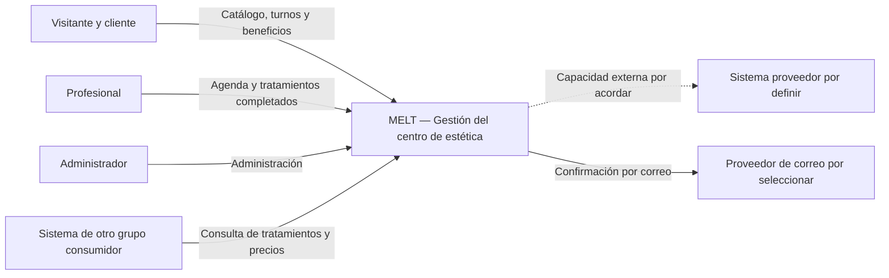
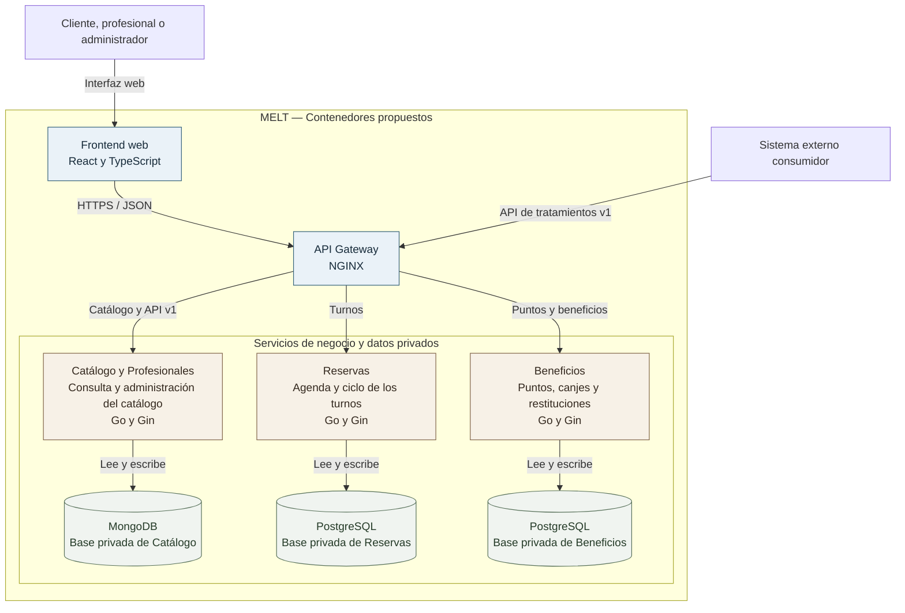

# MELT — Arquitectura inicial

**Versión:** 0.2 — Propuesta inicial para revisión del equipo.  
**Entrega:** 1 — 9 de octubre de 2026.  
**Estado:** Diseño y documentación. No hay servicios, infraestructura, pruebas, contratos, mocks ni despliegues implementados en el repositorio actual.

## 1. Introducción y objetivos arquitectónicos

MELT es una aplicación web para un centro de estética de una sola sucursal. Ofrece catálogo público, reservas autenticadas, agenda profesional, administración y beneficios basados en puntos. La reserva con validación de disponibilidad es la operación central; su confirmación, la realización del tratamiento y el pago presencial son hechos diferentes.

Se propone una arquitectura de tres microservicios y un API Gateway. La separación responde a capacidades de negocio con reglas y datos propios y al objetivo del proyecto de desarrollar un sistema distribuido. Permite asignar responsabilidades claras, pero introduce comunicaciones remotas y coordinación que el equipo deberá comprender y verificar. No se justifica por una escala de producción que todavía no se ha medido.

Los objetivos son evitar turnos superpuestos y operaciones duplicadas, preservar los datos de cada servicio y permitir evolución gradual. El alcance funcional se encuentra en [SPEC.md](../SPEC.md) y la presentación general en [README.md](../README.md).

Se distinguen **decisiones funcionales acordadas**, **límites preliminares**, **tecnologías propuestas** y **mecanismos pendientes**. Esta versión define la arquitectura necesaria para revisar la primera entrega, sin dar por completados sus artefactos ni el sistema final.

## 2. Diagrama de contexto

El visitante utiliza el catálogo sin sesión; el cliente necesita identificarse para reservar. El proveedor externo es una relación pendiente, no una integración ya seleccionada. El pago presencial queda fuera de las comunicaciones del sistema.

## 3. Diagrama de contenedores

La vista principal muestra el ingreso al sistema y las bases privadas de los tres servicios. Las comunicaciones internas y los componentes de apoyo se resumen en las secciones siguientes para mantener el diagrama legible.

El frontend se comunica con el backend a través del gateway. El consumidor externo accede a la API de tratamientos por la misma entrada pública. Cada base pertenece a un solo servicio. Los proveedores externos aparecen en el contexto; la capacidad consumida no tiene todavía un servicio responsable asignado.

| Componente de apoyo propuesto | Función |
| :--- | :--- |
| RabbitMQ | Mensajería para eventos y efectos posteriores, como puntos y notificaciones. |
| OpenSearch | Búsqueda de tratamientos administrada por Catálogo. |
| Redis | Caché de un flujo relevante de consulta del catálogo. |
| Prometheus y Grafana | Métricas y tableros del sistema. |

Estos componentes forman parte de la evolución prevista y no están configurados. La autenticación y autorización son necesarias; su mecanismo concreto permanece abierto.

## 4. Microservicios: responsabilidades y límites

| Servicio | Responsabilidades preliminares |
| :--- | :--- |
| Catálogo y Profesionales | Administrar tratamientos, categorías, profesionales y aptitudes; publicar nombres, imágenes, descripciones, precios, duraciones y puntos fijos por tratamiento. Ofrecer catálogo público, búsqueda y API propia de consulta. |
| Reservas | Administrar agenda, disponibilidad efectiva, turnos, confirmación, cancelación y finalización de tratamientos. Ofrecer próximos turnos, historial de realizaciones y agenda profesional. Coordinar beneficios aplicados y correo de confirmación. |
| Beneficios | Administrar saldos, movimientos, recompensas, canjes, aplicaciones y restituciones. Acreditar puntos por tratamientos completados y controlar que no se dupliquen sus efectos. |

Reservas es la autoridad de disponibilidad y ocupación. Catálogo administra la información del profesional y los tratamientos que puede atender, pero no mantiene una segunda agenda editable. Beneficios utiliza los puntos configurados por tratamiento; no es dueño del catálogo.

Las categorías iniciales son Facial, Corporal, Depilación y Manos y uñas. Los tres roles se mantienen: cliente, profesional y administrador. El registro ordinario de tratamientos completados corresponde al profesional; las facultades administrativas excepcionales siguen pendientes.

Los límites deberán formalizarse en D1 y podrán evolucionar mediante ADR si aparece evidencia que lo justifique. Los trabajadores de correo o procesamiento de eventos pertenecerán al servicio responsable; no se propone un microservicio adicional por cada efecto.

## 5. Propiedad de los datos y persistencia inicial

| Servicio | Datos propios | Persistencia propuesta y motivo |
| :--- | :--- | :--- |
| Catálogo y Profesionales | Categorías, tratamientos, referencias de imágenes, precios, duraciones, puntos configurados, profesionales y aptitudes. | MongoDB: lectura y actualización de documentos del catálogo con información descriptiva e imágenes asociadas. |
| Reservas | Horarios, excepciones, turnos, intervalos, estados, realizaciones y referencias a beneficios aplicados. | PostgreSQL: relaciones y transacciones para proteger la agenda y las transiciones del turno. |
| Beneficios | Saldos, movimientos de puntos, beneficios, canjes, aplicaciones y restituciones. | PostgreSQL: cambios consistentes de saldo y movimientos, con control de duplicación. |

Se proponen dos tipos de almacenamiento primario, relacional y no relacional. Cada servicio tendrá datos y credenciales privados. Reservas y Beneficios podrán compartir una instancia de PostgreSQL en desarrollo, pero utilizarán bases separadas: no compartirán tablas ni consultarán directamente datos ajenos.

Las referencias entre servicios se transmitirán mediante identificadores por API o eventos. OpenSearch y Redis contendrán copias derivadas, no serán autoridad sobre agenda, saldo o validaciones comerciales. El alojamiento de imágenes, los esquemas, migraciones e índices se definirán posteriormente.

La persistencia se registrará como versión inicial de D3. MongoDB no determina por sí solo cómo publicar cambios de forma confiable; ese mecanismo y sus requisitos de configuración se evaluarán con el diseño de comunicación.

## 6. Tecnologías propuestas y justificación breve

| Área | Propuesta | Justificación inicial |
| :--- | :--- | :--- |
| Frontend | React y TypeScript | Interfaz web común para catálogo público y funciones de los tres roles. |
| Backend | Go y Gin | Lenguaje compartido y transporte HTTP para los tres servicios. |
| API Gateway | NGINX | Entrada pública, enrutamiento y futuro balanceo; requiere completar las políticas de acceso. |
| Persistencia | MongoDB y PostgreSQL | Documentos del catálogo y operaciones transaccionales de agenda y puntos. |
| Mensajería | RabbitMQ | Comunicación asíncrona mediante publicación y consumo de eventos. |
| Búsqueda | OpenSearch | Búsqueda textual con filtros, paginación y ordenamiento. |
| Caché | Redis | Copias temporales de lecturas relevantes del catálogo. |
| Ejecución local | Docker y Docker Compose | Futuro procedimiento único y automatizado de arranque. |
| Observabilidad | Prometheus y Grafana | Métricas y tableros para comprender el estado del sistema. |

Estas herramientas no están implementadas y sus versiones no están fijadas. No se incorpora un proveedor de identidad como decisión cerrada: la autenticación y autorización deberán seleccionarse y justificarse antes de implementar las operaciones privadas.

La arquitectura interna deberá utilizar al menos dos estilos diferentes en servicios distintos. Como candidatos se conservan capas para Catálogo y arquitectura hexagonal para Reservas y Beneficios. Su elección y justificación se desarrollarán en D2; los frameworks no sustituyen esa decisión.

## 7. Comunicación entre servicios

### 7.1. Interacciones preliminares

| Interacción | Modalidad propuesta | Propósito |
| :--- | :--- | :--- |
| Frontend → gateway → servicio | HTTP/JSON | Consultas y operaciones según el rol. |
| Reservas → Catálogo | Síncrona | Verificar tratamiento, aptitud del profesional y datos necesarios para reservar. |
| Reservas → Beneficios | Síncrona, sujeta al diseño del flujo | Validar y coordinar la aplicación de un beneficio durante la reserva. |
| Reservas → RabbitMQ → Beneficios | Asíncrona | Acreditación por tratamiento completado y restitución por cancelación válida. |
| Reservas → RabbitMQ → procesamiento de correo | Asíncrona | Enviar la confirmación sin hacer depender el turno del proveedor de correo. |
| Catálogo → procesamiento de búsqueda | Asíncrona, candidata mediante RabbitMQ | Reflejar cambios del catálogo en el índice. |

El gateway enruta las solicitudes y aplica políticas de entrada; no concentra reglas de reservas ni saldo. El catálogo se explora sin sesión; reservar requiere ingreso o registro. La autorización sobre el turno, la agenda y los puntos se verificará en el servicio responsable.

### 7.2. Garantías que deberán completarse

Las operaciones remotas necesitarán tiempos de espera, tratamiento de errores y respuestas ausentes o tardías, y una política de reintentos. Una respuesta perdida no prueba que el efecto no ocurrió. La repetición deberá preservar una única operación de negocio.

La mensajería deberá publicar y consumir eventos de dominio, evitar efectos duplicados y tratar mensajes fallidos. Se proponen hechos como turno confirmado, tratamiento completado y turno cancelado; sus esquemas, reintentos y recuperación están pendientes.

Transactional Outbox se conserva como **patrón candidato** para evitar perder efectos entre la persistencia y la publicación. No se impone en todos los servicios ni se fija su implementación en esta entrega. Se evaluará con los mecanismos de idempotencia y recuperación cuando se diseñen los flujos.

D5 inicial registrará las interacciones y modalidades preliminares y hará explícitas las decisiones aún abiertas. Los tiempos, estados técnicos y estrategias definitivas se completarán durante el desarrollo.

## 8. Flujos principales del sistema

### 8.1. Reserva y concurrencia

1. El cliente consulta el catálogo y se identifica para reservar.
2. Selecciona tratamiento, profesional, fecha y horario; puede elegir un beneficio disponible.
3. Reservas obtiene de Catálogo los datos necesarios y verifica la disponibilidad efectiva de su agenda.
4. La confirmación debe proteger el intervalo frente a solicitudes concurrentes, sin limitarse a una consulta previa de horarios. Se propone usar transacciones y restricciones de PostgreSQL; el mecanismo concreto se definirá con D4.
5. Si hay beneficio, Reservas y Beneficios coordinan su validación y aplicación antes de informar el resultado definitivo.
6. Una reserva válida se confirma automáticamente, muestra el resumen y genera el correo de confirmación.

La solicitud rechazada no crea un turno confirmado. La repetición no puede generar otra reserva por la misma intención. El pago se realiza presencialmente; no se incorpora un servicio de pagos.

### 8.2. Tratamiento completado y puntos

El profesional registra la realización en Reservas. El estado completado habilita un evento para que Beneficios acredite los puntos fijos configurados para el tratamiento, una sola vez. Reservar no acredita puntos y el pago presencial no determina la finalización.

La regla aplicable cuando cambia la configuración de puntos y los casos de tratamientos gratuitos o con descuento siguen pendientes en SPEC. Se deberá conservar la información necesaria para explicar la acreditación.

### 8.3. Canje, aplicación y restitución

Beneficios valida las condiciones y el saldo para canjear puntos por descuentos o tratamientos gratuitos. Reservas vincula el beneficio aplicado con el turno; cualquier importe restante se paga presencialmente.

El cliente puede cancelar desde su perfil hasta 24 horas antes del inicio. Reservas registra la cancelación y libera el horario; Beneficios restituye automáticamente los puntos o el beneficio utilizado, sin duplicados.

La reserva con beneficio involucra dos servicios con bases diferentes. Debe evitarse consumir puntos sin resolver el turno, reutilizar un beneficio o perder una restitución. La estrategia definitiva de coordinación, recuperación y posibles compensaciones se evaluará al diseñar e implementar el flujo; no se adopta una saga completa como decisión cerrada.

### 8.4. Estados funcionales y fallas

Se conserva el modelo funcional propuesto de turnos confirmados, cancelados y completados, con las transiciones y aprobaciones detalladas en SPEC. La acreditación y restitución pueden requerir procesamiento posterior; no deben confundirse con el estado del turno.

Cuando no se conozca el resultado de una operación, se deberá permitir verificarlo sin duplicar sus efectos. Una falla del correo o de una acreditación no debe borrar el hecho de negocio ya registrado. Los estados internos de recuperación y la instrumentación necesaria se definirán después.

## 9. Capacidad propia para integración externa

### 9.1. API de consulta de tratamientos

La capacidad elegida es una API versionada de consulta de tratamientos con filtros, descripciones y precios. Catálogo y Profesionales será responsable y el gateway la publicará para el sistema consumidor.

| Operación propuesta | Resultado previsto |
| :--- | :--- |
| `GET /api/v1/tratamientos` | Lista de tratamientos con búsqueda, filtros, paginación y ordenamiento. |
| `GET /api/v1/tratamientos/{id}` | Información descriptiva y precio del tratamiento identificado. |

Los datos públicos previstos incluyen identificador, nombre, categoría, descripción y precio; imágenes, duración y profesionales se acordarán en el contrato. No se expondrán clientes, agendas privadas, credenciales ni movimientos de puntos.

Se preparará un contrato OpenAPI v1 con parámetros, formatos de importes y moneda, respuestas, errores, ejemplos y condiciones de acceso. Los filtros concretos y límites de página deberán cerrarse para ese contrato. Los cambios incompatibles requerirán versionado explícito y comunicación al consumidor.

El contrato se almacenará en `docs/contracts/tratamientos-v1.openapi.yaml`, acompañado por `docs/contracts/README.md` y un mock coherente con sus ejemplos y errores. Estos archivos todavía no existen y deben prepararse para la primera entrega. El mock no sustituye la capacidad real, que deberá ponerse en funcionamiento y publicarse en un entorno accesible en las etapas siguientes.

### 9.2. Capacidad externa a consumir

El proveedor y la capacidad aún no están asignados. Una vez definidos, se identificará un flujo importante con consecuencias de negocio y el servicio que lo utiliza. La llamada saldrá desde ese microservicio, sin originarse en el frontend ni utilizar el gateway propio como intermediario hacia el proveedor.

Se deberán respetar el contrato publicado, verificar incompatibilidades y definir qué observa el usuario cuando el proveedor falla. No se inventa una integración concreta en esta versión.

## 10. Estructura inicial del repositorio

Actualmente existen `README.md`, `SPEC.md`, `docs/ARCHITECTURE.md` y los PDF en `referencias/`. No hay todavía estructura real de servicios, módulos ni dependencias declaradas.

| Ubicación prevista | Contenido inicial pendiente |
| :--- | :--- |
| `services/catalogo-profesionales/` | Módulo Go independiente, entrada de API y descripción de responsabilidades y dependencias. |
| `services/reservas/` | Módulo Go independiente, entrada de API y descripción de agenda y validaciones. |
| `services/beneficios/` | Módulo Go independiente, entrada de API y descripción de puntos, canjes y restituciones. |
| `docs/adr/` | ADR D1, D8 y versiones iniciales de D3 y D5. |
| `docs/contracts/` | Contrato OpenAPI, documentación de consumo y mock de tratamientos. |

Para materializar la estructura se proponen `go.mod`, `README.md` y `cmd/api/main.go` en cada servicio. Serán una base de organización y dependencias, sin declarar implementada la lógica de negocio. Su creación se realizará en una tarea posterior autorizada; esta tabla no equivale a una estructura real.

El mock se propone como un programa Go independiente en `docs/contracts/mock/`, con `go.mod`, `main.go` y `README.md` para su ejecución. No requiere introducir otra tecnología. Sus respuestas se ajustarán al contrato que se apruebe.

El frontend y la configuración ejecutable de Docker Compose se incorporarán durante el desarrollo. El arranque final deberá ser único, automatizado y documentado, sin configuraciones personales ni secretos en el repositorio.

## 11. Decisiones arquitectónicas y aspectos pendientes

### 11.1. Registros necesarios para la primera entrega

| Decisión | Contenido preliminar que deberá formalizarse | Archivo pendiente |
| :--- | :--- | :--- |
| D1 — Límites | Tres capacidades de negocio, sus relaciones y propiedad exclusiva de datos. | `docs/adr/ADR-001-limites-servicios.md` |
| D8 — Contrato propio | API de tratamientos, consumidor, datos públicos, versionado y compatibilidad. | `docs/adr/ADR-008-contrato-propio.md` |
| D3 inicial — Persistencia | MongoDB para Catálogo y PostgreSQL para Reservas y Beneficios; motivos, patrones de acceso y límites. | `docs/adr/ADR-003-persistencia.md` |
| D5 inicial — Comunicación | Validaciones síncronas y eventos asíncronos; garantías y cuestiones abiertas. | `docs/adr/ADR-005-comunicacion.md` |

Estos ADR deben ser archivos independientes con alternativas y consecuencias. Su descripción aquí no reemplaza los registros. La estructura real de servicios, el contrato y el mock siguen pendientes, por lo que la primera entrega todavía no está completa.

### 11.2. Aspectos pendientes

- Mecanismo de autenticación y autorización y detalle de permisos.
- Modalidad exacta de canje y restitución, vigencia de puntos y beneficios y modificaciones del catálogo con reservas existentes.
- Control concreto de concurrencia y coordinación entre Reservas y Beneficios.
- Publicación confiable, idempotencia y recuperación; evaluación de Outbox y compensaciones.
- Filtros, ordenamiento, parámetros y errores del contrato propio.
- Capacidad y proveedor externos, flujo importante y servicio consumidor.
- Políticas de búsqueda y caché, balanceo, fallas, instrumentación, versiones y recursos de ejecución.

Los valores comerciales permanecen abiertos; no se fijan tratamientos específicos, precios, cantidades de puntos ni horarios. La interfaz mantendrá español, identidad editorial minimalista, paleta de manteca, crema y chocolate, fotografía protagonista, navegación principal vertical y composiciones originales sin exceso de tarjetas ni bordes redondeados. Maquetas, categorías circulares, tipografías, animaciones y diseño responsive detallado no son decisiones cerradas.

## 12. Evolución prevista para próximas entregas

Los requisitos del sistema completo se conservan como compromisos de desarrollo. No se exige que todos sus mecanismos estén implementados o completamente definidos en esta primera versión.

| Etapa | Desarrollo y evidencia previstos |
| :--- | :--- |
| Entrega 2 — 23 de octubre | Al menos un servicio operativo y capacidad propia funcionando, almacenamiento integrado, logs correlacionados y primera traza del flujo principal. Desarrollar D2, D6, D7, D9, D10, D12 y D13; validar D1, D3 y D5; iniciar D11 y actualizar D8 si corresponde. |
| Presentación grupal — fecha asignada en noviembre | Frontend completo, entrada con autenticación y control de tráfico, tres servicios operativos, capacidad propia pública e integración externa en un flujo importante. Integrar persistencia relacional y no relacional, dos estilos internos, mensajería, búsqueda y caché con evidencia y limitaciones documentadas. |
| Defensa individual | Demostrar concurrencia y consistencia, pruebas unitarias e integración real, test de contrato, carga analizada, balanceo entre dos o más instancias con detección de indisponibilidad, fallas controladas, observabilidad y postmortem. |

### 12.1. Compromisos técnicos pendientes de diseño y verificación

- **Búsqueda:** filtros relevantes, paginación y ordenamiento; actualización ante cambios del catálogo y retraso máximo tolerable definido. OpenSearch es la propuesta, sin imponer ahora el mecanismo de reconstrucción.
- **Caché:** al menos una lectura relevante, con justificación por necesidad observable y métricas de impacto. Redis es candidato; vigencia e invalidación se diseñarán y medirán posteriormente.
- **Balanceo:** al menos un servicio en dos o más instancias, con reconocimiento de indisponibilidad y evidencia de distribución. Reservas es candidato; la configuración de NGINX y la demostración quedan para su etapa.
- **Resiliencia:** identificar dependencias y comportamiento ante lentitud o falla; seleccionar al menos un mecanismo de protección y demostrarlo mediante una caída controlada. Tiempos, reintentos, circuit breakers y recuperación se evaluarán sin fijar una combinación prematura.
- **Observabilidad:** logs estructurados, métricas y tableros que permitan comprender una operación. La instrumentación, trazas, alertas y almacenamiento se definirán en las etapas correspondientes.
- **Pruebas:** reglas relevantes del negocio, integración por servicio con una dependencia real, contrato de la capacidad consumida y carga con resultados analizados. No existen pruebas ni porcentajes de cobertura acreditados.
- **Operación:** arranque local único y automatizado, capacidad propia accesible durante la evaluación y `docs/POSTMORTEM.md` para la caída provocada. El repositorio público y la versión final en la rama principal deberán verificarse al preparar la entrega correspondiente.

La principal limitación de esta propuesta es la coordinación entre datos privados de servicios distintos. La simplificación posterga su solución detallada, pero mantiene las garantías funcionales de reserva, acreditación, canje y restitución. No se compromete una arquitectura de alta disponibilidad completa ni una escala de producción todavía desconocida.
